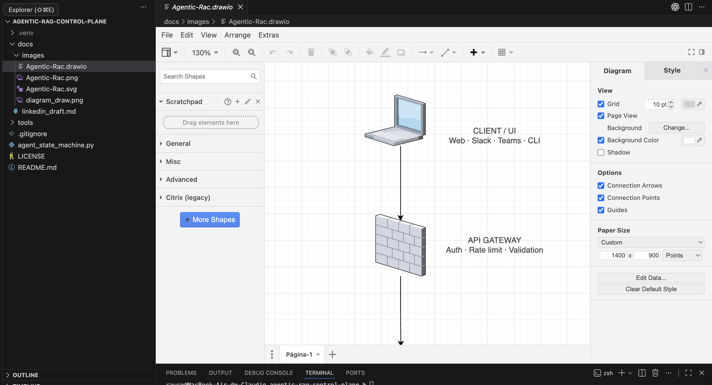
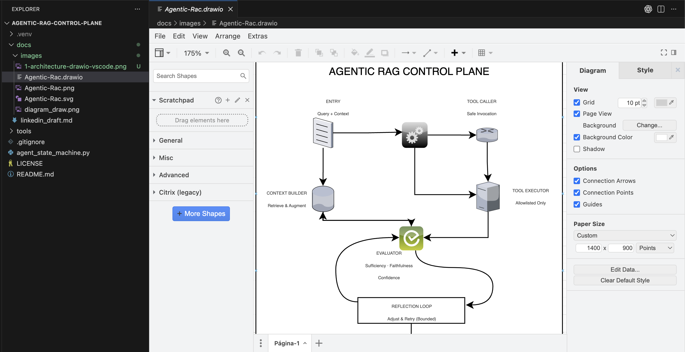
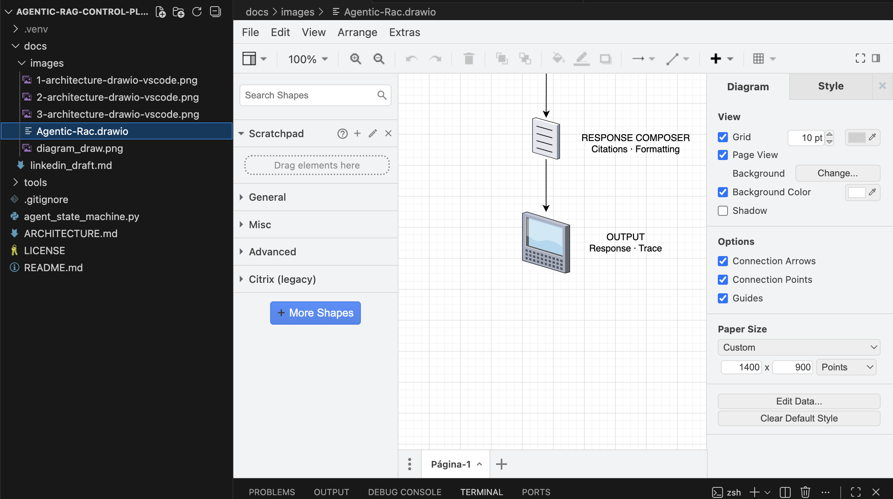

# Agentic RAG Control Plane

A minimal reference implementation of an **agentic RAG control plane** focused on explicit control, determinism, and traceability.

This project explores how to design agents where **planning, tool invocation, evaluation, and response composition are first-class architectural concerns**, rather than implicit behavior hidden inside a single LLM call.

---

## What Is an Agentic RAG Control Plane?

An agentic RAG control plane is the **decision and governance layer** of an agentic system.

It is responsible for:
- interpreting user intent,
- planning actions,
- selecting and validating tools,
- evaluating intermediate results,
- and deciding whether to retry, adjust, or finalize a response.

Crucially, it is **separate from the execution layer** that performs retrieval, database access, or external API calls.

This separation enables:
- deterministic control over agent behavior,
- explicit safety boundaries for tool use,
- and full observability of every decision the agent makes.

---

## High-level Architecture

The architecture is designed and maintained directly inside the repository using Draw.io integrated in VS Code.

### Architecture design inside the repo

The diagram is not a static illustration: it is versioned, editable, and treated as part of the system design.

---

### Agentic RAG Control Plane (core)

The control plane consists of explicit stages:

- **Entry**  
  Receives the user query and initial context.

- **Strategy Planner**  
  Interprets intent and determines whether tools are required.

- **Tool Caller**  
  Issues structured, validated tool requests.

- **Tool Executor**  
  Executes only allow-listed tools (no free-form SQL or side effects).

- **Context Builder**  
  Aggregates retrieved data and intermediate results.

- **Evaluator**  
  Assesses sufficiency, faithfulness, and confidence.

- **Reflection Loop (bounded)**  
  Allows controlled retries or adjustments based on evaluation results.

---

### Response composition and output

- **Response Composer**  
  Assembles the final answer, including formatting and citations.

- **Output**  
  Returns the response together with trace information for inspection or auditing.

---

## Design Principles

- Explicit states and deterministic transitions for agent workflows.
- Clear separation between planning, evaluation, and execution.
- Tool usage is structured, validated, and allow-listed.
- No implicit or opaque side effects.
- Small, testable components with well-defined responsibilities.
- Architecture artifacts (diagrams) are treated as code.

---

## Project Status

This repository is a **reference implementation** intended for experimentation, learning, and design validation.

It is not production-ready, but it provides a concrete foundation for building controlled, auditable agentic RAG systems.