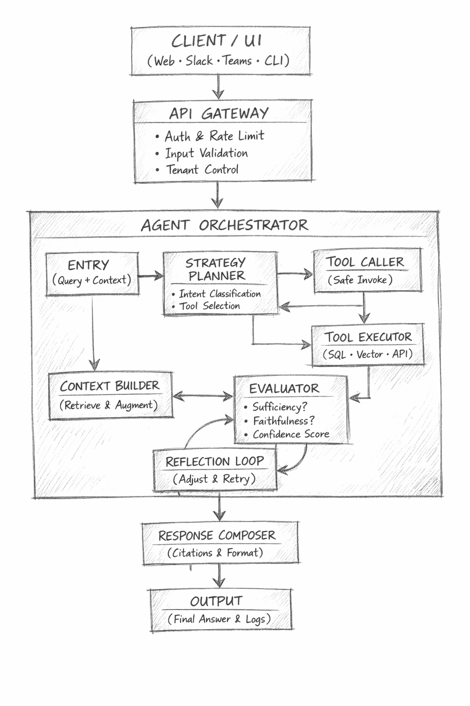

# Agentic RAG Control Plane

A minimal reference implementation for an agentic RAG control plane. The goal is clarity and explicit control: the system separates planning from execution, validates tool use, and records every step for traceability.

## What Is an Agentic RAG Control Plane?

An agentic RAG control plane is the decision-making layer that governs how an agent plans, selects tools, evaluates outcomes, and produces responses. It is distinct from the execution layer that runs tools and data operations. This separation enables deterministic control over agent behavior and makes every step observable and auditable.

## High-level Architecture

*Diagram: Control plane governs planning and evaluation, while execution performs tool actions under strict validation.*

The architecture separates control from execution:
- Control plane: explicit planning, evaluation, reflection, and response generation.
- Execution: validated tool invocation and data access with no arbitrary code execution.
- Traceability: every decision, transition, and tool call is captured for auditability by design.

## Principles

- Explicit states and deterministic transitions for agent workflows.
- Tool requests are structured and validated before execution.
- No free-form SQL or opaque side effects.
- Small, testable modules with clear boundaries.

## Status

This is a reference implementation intended for experimentation and design validation. It is not production-ready.
